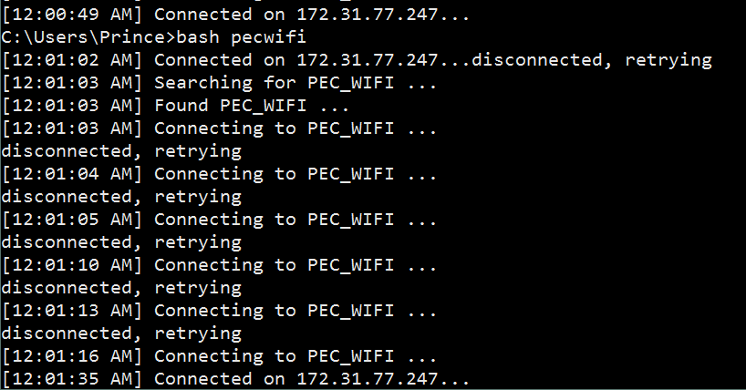

# Simple script to connect to PEC_WIFI on __Windows__

This script is made for PEC students who are facing problem with connecting to `PEC_WIFI`.

## Why I made this?

I faced a problem with my laptop. The problem was that my laptop went on disconnecting from the Wi-Fi after a small time (~10min). And
I was downloading a big file (35GB). And I was wasting my time on connecting to Wi-Fi after every 10 min.
So I started writing this script. This script was successful and I was able to download the file without even
touching my laptop. This script is nothing just an infinite loop which will continuously monitor network status after every 1 sec.
I hope you will like it.

## What will you need?

+ Bash on Windows(required)

### How to get bash?

So, now let's talk about how to get `bash` on windows. If you're a CSE student, then you might know about bash (Yes, it is the terminal used in Ubuntu). You can install `bash` by installing Git for Windows.

Facing any problem, report an issue [here](https://github.com/PrinceDhaliwal/pecwifi/issues/new). If you can't do that, then message me on [facebook](http://www.facebook.com/0x1000).

## How to run it?

If you followed step 1 in previous section, follow these steps:
+ Extract the zip file to `C:/bin` (you can choose your own path).
+ Add this folder to your environment variable `Path`. If you don't know about it, then contact me.
+ Download the zip file of [pecwifi](http://github.com/PrinceDhaliwal/pecwifi). CSE people should `git clone` this.
+ Extract this zip file to same folder `C:/bin`. __`pecwifi` file should always be there in `C:/bin`__.
+ Open command prompt, type `bash pecwifi` and hit enter.
+ Done, Your laptop should connect to Wi-Fi within 2 or more tries. On connection, you will see message `[Sat May  7 21:15:42 IST 2016] Connected on 172.31.77.247...`

If you are still facing the problem, then contact me.

## Liked this? Click on star button above.

## To-do
I don't know about batch programming, so it has unnecessary dependency of installing bash (This shouldn't be there). So help me out in removing it.
Feel free to contribute.

This script currently works only on Windows. So, it has to be ported to Linux also.

## Contact

http://www.facebook.com/0x1000

## Screenshot

